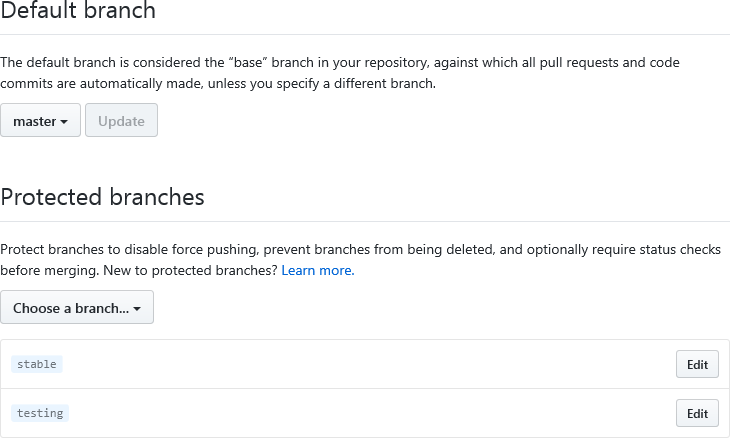
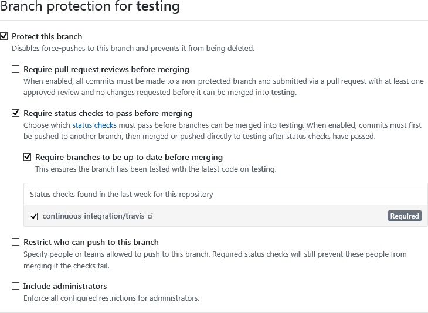
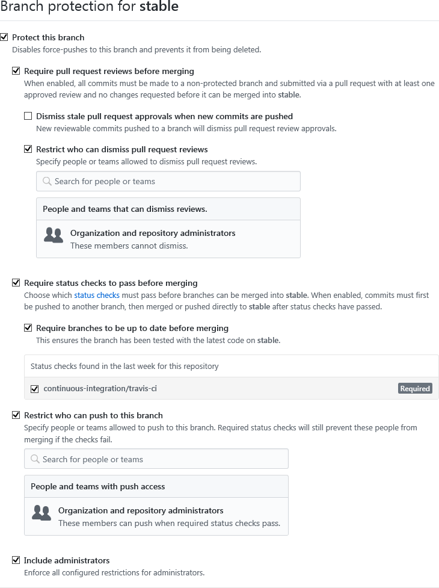

# Development process
Every IUNO repository shall consist of at least these three branches:
* *master* shall always compile
* *testing* shall always be ready to run
* *stable* shall be stable for productive use

All new features shall be developed on separate branches. As soon as a feature is complete it shall be merged into *master*.

Features from *master* may be merged into *testing* any time as long as there are no known errors that affect funcionality.

The branch *testing* may only be merged into *stable*, if the head of *testing* has been thoroughly tested.

## Branch settings
The settings shown in the next sections shall be used for the different branches.

### Master

### Testing

### Stable

